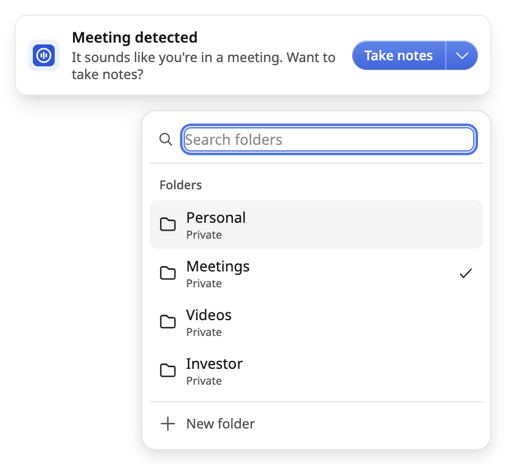
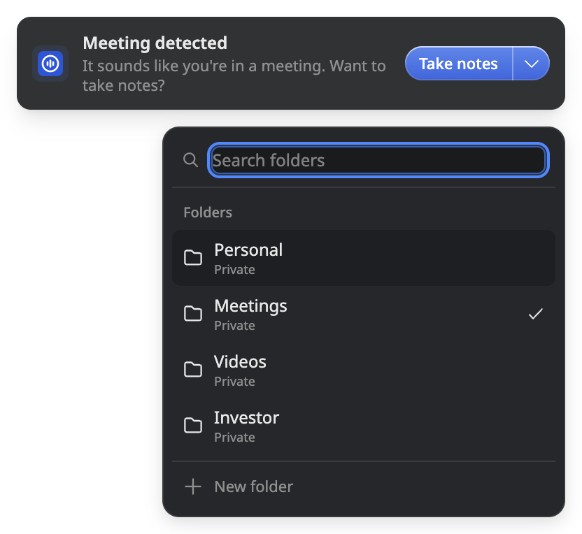
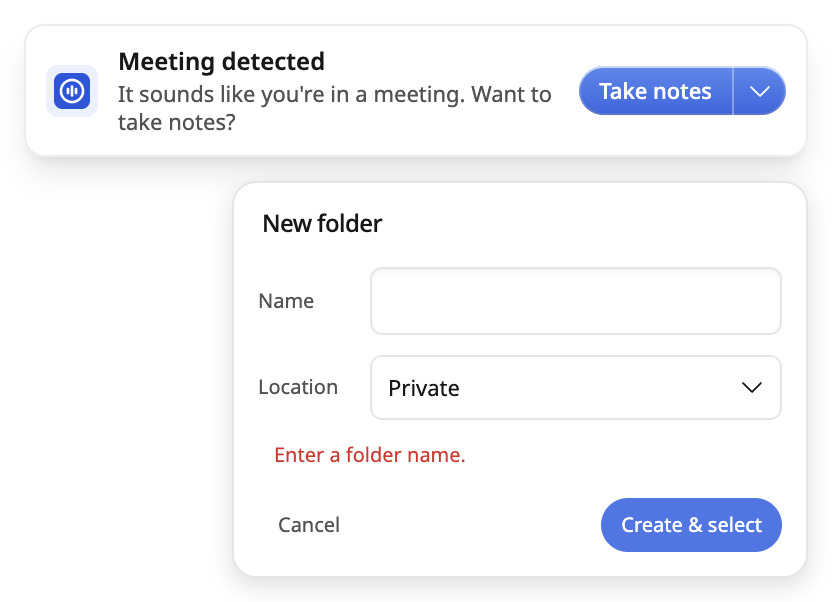

# Meeting notification folder picker — validation and handover

2026-10-05. Implements the approved revision-6 plan in Titan's
`docs/superpowers/plans/2026-09-30-meeting-notification-folder-picker.md` and the
accepted v10 prototype (SHA-256
`3a541ab552da2815270acebe85ad93bb1184534d24bd9539c22a86ac29d15dc1`).
Base: `0575eea0b9ed46b591275d2a08332febcff265d8`.

## Delivered behavior

The notification's split action opens a protected, searchable folder dropdown.
It shows up to five session recents, honest Folders fallback, and a current
selection outside those five. A Private-first Name/Location form creates a folder
and selects it without starting a meeting. Shared destinations identify their
space and audience. Selection feedback lasts 1,200 ms (200/600/400).

Main-process ownership binds all work to the current notification, detection,
window, database account and credential generation. Create retries preserve the
committed folder. Start validates the current destination, atomically creates a
note there, or asks the user to acknowledge an existing note's actual location,
including a space root. It never moves or duplicates that note. Editor loading is
bounded and followed by a single-use, current-panel, live-note confirmation
before recording is requested. Failed navigation retries reuse the saved note.

No dependency, schema, migration or backend changes. No production data writes,
merge, release, deployment or outbound messages were performed.

## Automated evidence

Use Node 24 and a Node-compatible better-sqlite3 binding:

```sh
npm ci --ignore-scripts
npm rebuild better-sqlite3
REQUIRE_DB_TESTS=1 npm test
npm run typecheck
npm run lint
npm run i18n:check
npm run build:renderer
```

Focused tests exercise real SQLite transactions/rollback and account scoping;
actual IPC handler methods; prompt ownership, timers, geometry and navigation
with window fixtures; and mounted React renderer behavior with browser/IPC
fixtures. They cover delayed creation/cancellation, selection-only retry,
recents, linked root notes, missing destinations, stale account/window callbacks,
IME event ordering, captured swipe handling and feedback timing.

The first full run found a missing text-direction classification for the two new
inputs. Both fields now use `dir="auto"`, with the explicit policy inventory
updated. Final verification results are recorded in the draft PR and Titan
handover. Lint has existing warnings in unrelated settings tests and icon
primitives, without errors. The renderer build has existing chunk-size warnings.

## Native macOS evidence — scope matters

Host: macOS 26.6 / Darwin 25G72, Electron 41.10.7, Chromium 146.0.7680.216.
The isolated full application launched against a new local profile with external
renderer requests blocked and API/auth URLs pointed at loopback. Its fresh
onboarding screen was left untouched; no agreement or OS permission was accepted.

The interaction checks used the actual built overlay, real WindowManager,
DatabaseManager and folder IPC methods in a separate disposable notification
fixture. It injected a local detection and did not run a recording or backend
session. Native CUA input verified:

- Initial inactive notification (`isFocused=false`); explicit picker activation
  permits typing in search and Name while content protection remains enabled.
- Search pre-fills an unmatched name; Create & select persists one SQLite folder,
  closes the dropdown, emits confirmation, and leaves the note count zero.
- Empty-name error stays in the form, restores Name focus, and Escape returns
  form → list → passive compact window (`isFocused=false`).
- Light and dark list/form rendering inspected. This caught and repaired incorrect
  theme variable names that component tests could not catch.
- The same OS screenshot path excludes the open dropdown just as it excluded the
  compact baseline. This is one observed capture path, not universal exclusion.

The images below are **self-render captures** made by the app's own renderer for
visual inspection, with protection still enabled. They are not OS-capture tests:





## Remaining acceptance before merge/release

- Actual editor-to-recording completion, transcript persistence and resumed-note
  audio continuity in an isolated configured profile. Automated navigation and
  recording-store tests do not replace this physical acceptance.
- Real Shared-space sync and cold control-panel delivery on a connected test
  account. Current Shared/account evidence is SQLite and component fixtures.
- A real CJK input method (this host only had ABC keyboard input enabled).
- Underlying-application typing restoration and transparent-area hit testing
  without automation refocusing the target application.
- Physical small/negative-origin displays, Windows, Linux X11 and Wayland input,
  capture exclusion and window-manager behavior. Geometry is fixture-tested only.

Do not mark these as passed from the screenshots or unit tests.

## Review and worktree disposition

Main agent implemented all changes. Independent read-only deep/code-quality
reviewers traced main-process and renderer paths, then rechecked fixes. Selected
`codex review --base 0575eea0b9ed46b591275d2a08332febcff265d8` also ran, with a repair
recheck. Findings repaired include replaced/coalesced detection leaks, renderer
crash ownership, focus acknowledgment races, passive error-opened forms, close
shape coverage, IME pointer completion and captured swipe interactivity.

Branch: `codex/meeting-notification-folder-picker`. Worktree created by this
session: `/Users/joshuadavidpadoa/dev/ow-meeting-folder-20261005`. The final Titan
handover records whether it was retired or kept. The shared app checkout and
other sessions' worktrees were not changed. Native probes were stopped after
checking; fixture profiles and raw logs are local scratch, not product files.
