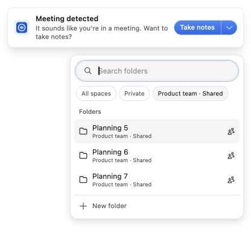
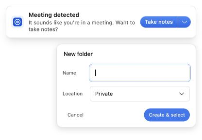
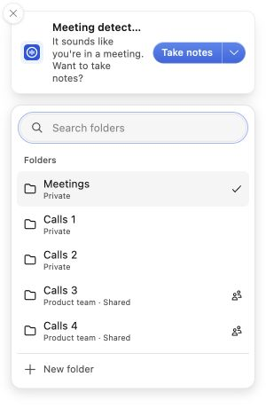
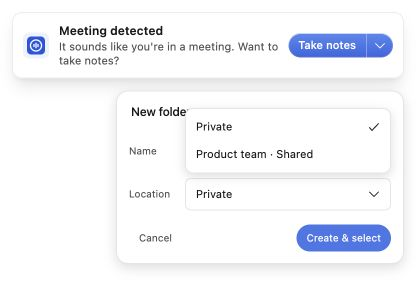
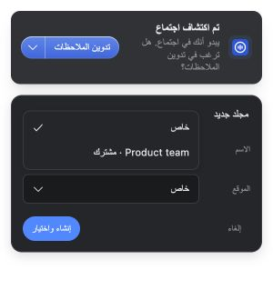

# Meeting notification folder picker — validation and handover

2026-10-05. Implements the approved revision-6 plan in Titan's
`docs/superpowers/plans/2026-09-30-meeting-notification-folder-picker.md` and the
accepted v10 prototype (SHA-256
`3a541ab552da2815270acebe85ad93bb1184534d24bd9539c22a86ac29d15dc1`).
Base: `0575eea0b9ed46b591275d2a08332febcff265d8`.

## Delivered behavior

The notification's split action opens a protected, searchable folder dropdown.
It shows up to five session recents, honest Folders fallback, and a current
selection outside those five. A Private-first Name/Location form creates a folder
and selects it without starting a meeting. Shared destinations identify their
space and audience. Selection feedback lasts 1,200 ms (200/600/400).

Main-process ownership binds all work to the current notification, detection,
window, database account and credential generation. Create retries preserve the
committed folder. Start validates the current destination, atomically creates a
note there, or asks the user to acknowledge an existing note's actual location,
including a space root. It never moves or duplicates that note. Editor loading is
bounded and followed by a single-use, current-panel, live-note confirmation
before recording is requested. Failed navigation retries reuse the saved note.

No dependency, schema, migration or backend changes. No production data writes,
merge, release, deployment or outbound messages were performed.

## Automated evidence

Use Node 24 and a Node-compatible better-sqlite3 binding:

```sh
npm ci --ignore-scripts
npm rebuild better-sqlite3
REQUIRE_DB_TESTS=1 npm test
npm run typecheck
npm run lint
npm run i18n:check
npm run build:renderer
```

Focused tests exercise real SQLite transactions/rollback and account scoping;
actual IPC handler methods; prompt ownership, timers, geometry and navigation
with window fixtures; and mounted React renderer behavior with browser/IPC
fixtures. They cover delayed creation/cancellation, selection-only retry,
recents, linked root notes, missing destinations, stale account/window callbacks,
IME event ordering, captured swipe handling and feedback timing.

The first full run found a missing text-direction classification for the two new
inputs. Both fields now use `dir="auto"`, with the explicit policy inventory
updated. Final verification results are recorded in the draft PR and Titan
handover. Lint has existing warnings in unrelated settings tests and icon
primitives, without errors. The renderer build has existing chunk-size warnings.

## Native macOS evidence — scope matters

Host: macOS 26.6 / Darwin 25G72, Electron 41.10.7, Chromium 146.0.7680.216.
The isolated full application launched against a new local profile with external
renderer requests blocked and API/auth URLs pointed at loopback. Its fresh
onboarding screen was left untouched; no agreement or OS permission was accepted.

The interaction checks used the actual built overlay, real WindowManager,
DatabaseManager and folder IPC methods in a separate disposable notification
fixture. It injected a local detection and did not run a recording or backend
session. Native CUA input verified:

- Initial inactive notification (`isFocused=false`); explicit picker activation
  permits typing in search and Name while content protection remains enabled.
- Search pre-fills an unmatched name; Create & select persists one SQLite folder,
  closes the dropdown, emits confirmation, and leaves the note count zero.
- Empty-name error stays in the form, restores Name focus, and Escape returns
  form → list → passive compact window (`isFocused=false`).
- Light and dark list/form rendering inspected. This caught and repaired incorrect
  theme variable names that component tests could not catch.
- The same OS screenshot path excludes the open dropdown just as it excluded the
  compact baseline. This is one observed capture path, not universal exclusion.

The images below are **self-render captures** made by the app's own renderer for
visual inspection, with protection still enabled. They are not OS-capture tests:


## Remaining acceptance before merge/release

- Actual editor-to-recording completion, transcript persistence and resumed-note
  audio continuity in an isolated configured profile. Automated navigation and
  recording-store tests do not replace this physical acceptance.
- Real Shared-space sync and cold control-panel delivery on a connected test
  account. Current Shared/account evidence is SQLite and component fixtures.
- A real CJK input method (this host only had ABC keyboard input enabled).
- Underlying-application typing restoration and transparent-area hit testing
  without automation refocusing the target application.
- Physical small/negative-origin displays, Windows, Linux X11 and Wayland input,
  capture exclusion and window-manager behavior. Geometry is fixture-tested only.

Do not mark these as passed from the screenshots or unit tests.

## Review and worktree disposition

Main agent implemented all changes. Independent read-only deep/code-quality
reviewers traced main-process and renderer paths, then rechecked fixes. Selected
`codex review --base 0575eea0b9ed46b591275d2a08332febcff265d8` also ran, with a repair
recheck. Findings repaired include replaced/coalesced detection leaks, renderer
crash ownership, focus acknowledgment races, passive error-opened forms, close
shape coverage, IME pointer completion and captured swipe interactivity.

Branch: `codex/meeting-notification-folder-picker`. Worktree created by this
session: `/Users/joshuadavidpadoa/dev/ow-meeting-folder-20261005`. The final Titan
handover records whether it was retired or kept. The shared app checkout and
other sessions' worktrees were not changed. Native probes were stopped after
checking; fixture profiles and raw logs are local scratch, not product files.

### Final browser repairs

The selected review's repair recheck exposed animated measurement and linked-panel
keyboard gaps. Regions now use untransformed layout offsets; the linked-note
explanation has a focusable dialog. Fourteen picker tests pass after these fixes.
A real browser fixture verified that a Russian underway card with bottom at
106px reports 118px from its first measurement, and that a root-linked panel
receives dialog focus and emits `focus: release` when Escape closes it.
The full local 7,022-pass run preceded these two renderer repairs; the focused
renderer tests, typecheck and rebuilt renderer cover the repaired commit, with
final-head GitHub CI recorded in the handover.

## Feedback pass — 2026-10-05

Code commit: `3067a4dbf`, based on the original reviewed head `3e7a66605`.
The exact existing `ow-meeting-folder-rig-2511` worktree and
`codex/meeting-notification-folder-picker` branch were reused. Refreshed main
`29d20f636` adds only unrelated Linux Settings and mobile dependency changes.

- Search now uses the main-navigation pill surface, icon and inset, with the
  localized folder placeholder and no shortcut badge. Search and Name opt out
  of the global embossed input style so the picker has a single thin focus
  indication. Form fields use logical 10px inset.
- Private and Shared folders appear together in the results list, with no
  separate space-filter section. Shared rows identify their teamspace. Search
  matches the displayed space/folder path across all folders, including those
  outside the five initial suggestions. Selection retains the exact space and folder IDs, and
  new-folder creation still starts Private after a Shared choice. Matching
  paths do not incorrectly prefill a new folder name.
- Identical native geometry reports no longer call `setBounds` again. Ownership,
  layout revision, focus release, hit regions and countdown handling still run.
  A real destroyed-window cleanup exception was fixed by retaining the
  webContents reference before the window closes.
- Both existing and created destination selections retain the same mounted,
  visible card, close the picker, release input focus and use the existing
  1,200 ms confirmation. They never invoke Start. The no-link audio test prompt
  still correctly says “Take notes.”

### Evidence and limits

At code commit `3067a4dbf`: **7,051 tests, 7,036 passed, zero failures, 14 skips, one TODO** with
`REQUIRE_DB_TESTS=1` under Node 24.20.0. Two earlier runs encountered the known
local `better-sqlite3` native cleanup crash. Rebuilding the unchanged dependency
against official Node 24.18.0 headers produced the successful run; the rig's
Electron binding was backed up and restored before restart. No package or
lockfile changed. The 48 focused picker/window tests pass. Final typecheck,
lint (existing warnings only), i18n, renderer build and changed-file formatting
pass. Generated `src/dist` was removed after verification.

Independent read-only native and UI code-quality reviews and the selected
`codex review --uncommitted` found no remaining actionable code findings. The
UI review's path-prefill finding was reproduced, repaired, and rechecked.
Browser visual inspection found and repaired the global focus-shadow conflict.
The screenshots below render the actual component with fixture IPC/data; they
are **browser visual evidence, not native capture or recording acceptance**.
Light/dark, Arabic RTL, Name padding and a 300px surface were checked. At 300px,
the picker, search and New folder action have no horizontal overflow.






The live rig was restarted only after restoring its Electron binding. Its
signed-in staging account/calendar profile remains intact; the installed app
was not stopped. Native startup and a protected self-rendered compact prompt
were checked. The prior runtime-only trigger entered the real detection engine with
preference, recording and ownership gates intact; the subsequent normal restart
removed that hook. No recording or
folder creation was performed by this feedback verification in the real account.

**Native flash acceptance remains open.** Source tracing and regression tests
show no card remount, entrance replay, renderer navigation or window recreation
on selection; duplicate resize calls were reproducible and removed. This does
not establish that the necessary native contraction/focus release is flash-free.
Prior rig logs also show real audio detection replacing a synthetic prompt, but
there is no selection timestamp proving that caused the reported flash. Native
UI automation could inspect the control panel and a self-render capture but
could not reliably target the protected notification for this interaction.
Do not call the reported macOS flash resolved from browser/component tests alone.
All previously listed recording, Shared sync, IME, focus/hit-test and physical
platform acceptance gaps remain open.

### Kept rig and next native check

The existing worktree is intentionally kept at Josh's request and remains the
running dev rig. No new worktree was created. Profile reset/teardown, merge,
release, deployment and unrelated work were not performed.

The rig was restarted normally after the unified-results correction, preserving
its existing profile. The prior PID `89932` and process-lifetime SIGUSR2 hook are
no longer active; the obsolete `trigger-pid.txt` was removed. Do not signal the
new process. `main.js` remains unchanged. Local diagnostic evidence remains
ignored in `.superpowers/sdd/meeting-folder-feedback/`. The original launcher
and profile remain at the paths in the Titan kickoff handover.

The unified-results correction passed 23 focused picker/navigation/refresh tests,
typecheck, scoped ESLint, locale consistency, formatting and renderer build.
A fresh Codex review found no actionable regressions. Updated browser captures
show mixed Private/Shared rows in light, dark Arabic RTL and at 300px. The full
database suite above predates this narrow correction and was not repeated.
Josh has not yet tested the native flash behavior.

Next: choose an existing folder and complete Create & select in the native
notification, confirming only the saved check appears; then perform the pending
configured recording/Shared journeys. Use test destinations and preserve all
recording/account gates. CI status must be read at the published head; historical
CI above is not evidence for this feedback commit.


## Native close and location dropdown follow-up — 2026-10-05

Josh confirmed the combined folder list looked right, but reported that selection
still looked like a reload and opening the new-folder Location menu expanded the
form. This follow-up starts at `041dc439e` in the same preserved rig.

- The location selector now uses the existing nonmodal DropdownMenu. It overlays
  the form, stays within the picker's measured native hit region, scrolls when
  necessary, and handles keyboard navigation, selection, outside clicks and Escape.
  Picking a location preserves the draft; creation still requires Create & select.
- On macOS, closing the picker no longer calls BrowserWindow.blur(). Electron
  41.10.7 implements that operation with orderOut/orderBack, which removes and
  restacks the notification. Disabling focusability remains, matching the existing
  assistant-panel close pattern. Windows/Linux still blur on close.
  [Pinned Electron implementation](https://github.com/electron/electron/blob/v41.10.7/shell/browser/native_window_mac.mm#L440-L453).
- The user's latest rig log showed no renderer-load event or window replacement.
  Later hide/show events began 2.6 seconds after the last resize/blur and can also
  represent macOS occlusion; they do not independently establish the flash cause.
  The removed blur call is a confirmed native restacking operation. Physical
  visual smoothness and keyboard handoff still require acceptance.

Regression checks failed before the change for both macOS blur and keyboard
opening of Location. All 56 focused picker/navigation/window checks pass after
it, including all three platform close paths, Escape preserving the form and
Shared-location creation retaining the correct ID and draft. Typecheck, scoped
lint and renderer build pass. Independent native and dropdown reviews are
recorded in the session evidence. The full suite with required database
coverage passed: **7,054 tests, 7,039 passed, zero failures, 14 skips, one TODO**.
The unchanged SQLite test binding again used official Node 24.18 headers under
Node 24.20; the Electron binding was restored before restarting the rig.

Browser measurements showed the old form expanding from 173.30px to 244.30px;
the updated form remains 173.30px with its location menu open. This is browser
layout evidence using the actual component and fixture IPC, not native acceptance.




The existing worktree/profile are kept for Josh's next native test. No additional
worktree was created. Temporary rig diagnostics are ignored, main.js is restored
after startup, and no recording or real-account folder creation was performed by
the verification. The popup trigger remains process-specific; verify the current
probe-pid.txt against the rig executable before any signal.
